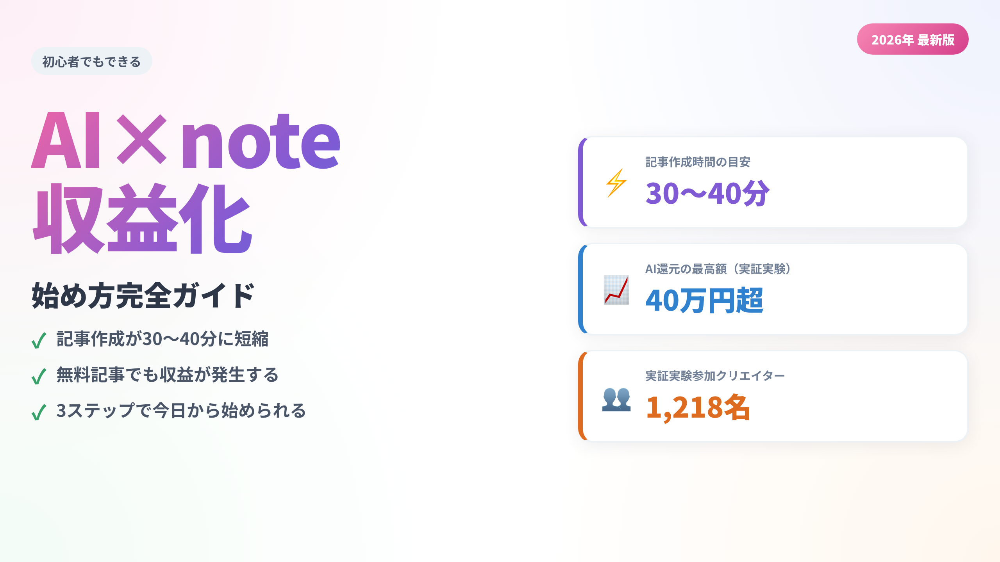
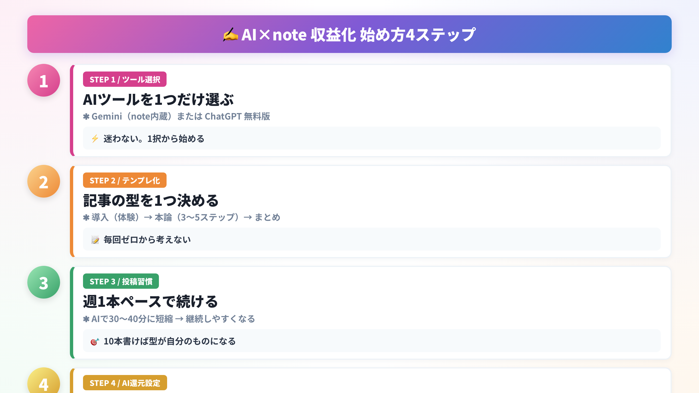
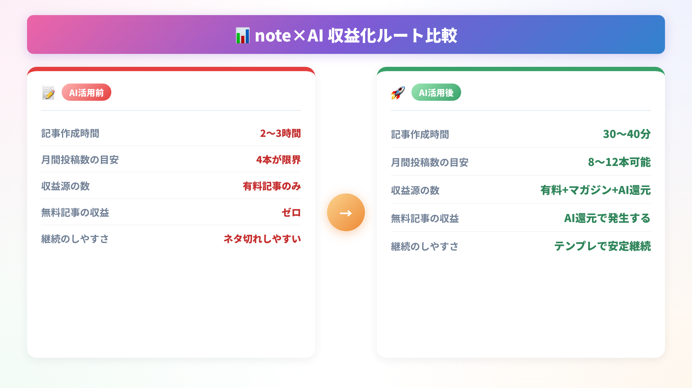

「noteで稼いでみたい」と思いながら、最初の一歩が踏み出せない人は多い。

私もそうだった。文章を書くのは好きでも、ゼロから記事を仕上げるのに毎回2〜3時間かかっていた。週1本更新するだけで精一杯。それがAIツールを使い始めてから、30〜40分で1本書けるようになった。

noteはいま、AIとの相性が非常によくなっている。プラットフォーム側がAIアシスタントを標準搭載し、さらに「AI学習対価還元プログラム」という新しい収益の仕組みも始まった。書く環境が整ったいまが、始め時だと思う。

この記事では「AIを使ってnoteで収益を得る」ための具体的な仕組みを、初心者でも再現できるよう整理して説明する。

## AIとnoteを組み合わせると何が変わるか

### 記事作成の時間が劇的に短くなる

AIを使う最大のメリットは「速さ」だ。

従来の記事作成フロー（テーマ決め→構成→執筆→校正）は、慣れた人でも2〜3時間かかる。AIを使うと、構成案の生成・たたき台の執筆・言い回しの修正をアシストしてもらえるため、**作業時間が30〜40分程度に短縮**できる。

ポイントは「AIに全部書かせる」のではなく、「自分の体験と考えをAIで整える」スタンスを取ること。自分の言葉が芯にあってこそ、読者に刺さる文章になる。

### 無料で使えるAIが揃っている

2025年以降、noteに標準搭載されたAIアシスタントにはGoogleの**Gemini**が採用された。全クリエイター無料・回数無制限で使える。

さらに外部ツールとしては以下が定番だ。

- **ChatGPT**（OpenAI）— 構成・文章生成に強い
- **Claude**（Anthropic）— 長文・論理的な文章が得意
- **Gemini**（Google）— note標準搭載。操作がシンプル

まずはnoteのエディタ上でGeminiを試してみると、ハードルが低くておすすめだ。

### AIを使うときの正しいスタンス

ここで一つ重要なことを先に言っておく。

「AIに全部書かせれば楽に稼げる」と思って始めると、ほぼ確実に挫折する。AIが生成した文章はどこか平坦で、読者に「どこかで見た内容」と感じさせてしまう。

有効な使い方は、**自分の体験や考えを「素材」として用意し、それをAIで整えて読みやすくする**というフローだ。たとえばこういう使い方をする。

- 「先週こんな失敗をした」という自分のメモをAIに渡し、記事の構成案を出してもらう
- 下書きの文章をAIに読ませて「わかりにくい箇所を直して」と指示する
- 見出しのバリエーションを5パターン提案させて、一番しっくりくるものを選ぶ

AIは「文章を作る機械」ではなく「自分の思考を整理して言語化するパートナー」として使うと、成果物の品質も読者の反応も変わってくる。

## note収益化の3つのルート

### ルート1：有料記事を販売する

最もシンプルな収益化がこれだ。記事を書いて100円〜10,000円で販売する。

売れやすいテーマのトップ3は次の通り。

- **AI・テクノロジー活用**（ChatGPT使い方、画像生成AIなど）
- **副業・収益化ノウハウ**（フリーランス、SNS運用など）
- **キャリア・スキルアップ**（転職、資格、学習法など）

「ツール紹介＋自分の使った体験＋収益への道筋」という三点セットが購買率を高める。

### ルート2：有料マガジン・メンバーシップ

単発の有料記事より安定収益を得たいなら、**有料マガジン（月額制）**か**メンバーシップ**が向いている。

月500円〜1,000円の継続課金でも、読者が10人集まれば月5,000〜10,000円になる。AIで週2〜3本のペースで更新し続けることで、読者が離れにくい仕組みを作れる。

### ルート3：AI学習対価還元プログラム

2025年8月から始まったnote公式の新しい仕組みがこれだ。

**仕組み：** noteがAI事業者にクリエイターのテキストコンテンツを学習データとして提供し、その対価をクリエイターに還元する。有料記事はもちろん、**無料で公開している記事も対象**になる。

実証実験では参加者1,218名に対して総額500万円超が還元され、最高額は40万円超を記録した。分配額はPV数・スキ数・文字数・専門性を総合評価して決まる。

> 注意点：現時点では具体的な金額は保証されていない。収益の柱にするより「無料記事から追加で入ってくるボーナス」と位置づけるのが現実的だ。

## 実際にどう始めるか

### ステップ1：AIツールを1つだけ選ぶ

最初からあれこれ試すと迷子になる。まずは**Gemini（noteエディタ内蔵）**か**ChatGPT無料版**の一択から始めよう。

### ステップ2：テンプレートを1つ決める

毎回ゼロから構成を考えるのが一番時間のムダだ。以下のシンプルな型を固定して使う。

- **導入**：自分の体験・悩みから書き出す（300字目安）
- **本論**：解決策を3〜5ステップで説明する（1,500字目安）
- **まとめ**：要点3つ＋次のアクション1つ（300字目安）

### ステップ3：週1本ペースで投稿を続ける

最初の1ヶ月は「売れるかどうか」より「書いて出す習慣をつくること」が優先だ。

10本書けば文章の型が自分のものになる。20本書けばスキ数やフォロワーの傾向がわかる。AIは「書き続ける体力を補う道具」として使うのが長続きするコツだ。

### ステップ4：無料記事でAI学習対価還元も設定する

記事を書いたら、必ずAI学習対価還元プログラムの設定を確認しておこう。

設定はデフォルトで「参加する」になっているが、自分の記事が対象になっているかをアカウント設定から確認するだけでいい。無料記事でも対象になるため、有料化しない記事からも収益を得られる可能性がある。

過去の実証実験（参加者1,218名）では総額500万円以上が還元され、最高額は40万円超だった。金額は保証されないが、コストゼロで参加できる仕組みなので、使わない手はない。

AI学習対価還元で評価されやすいのは「独自性の高い情報」とされている。つまり、自分が実際に試した検証結果・体験談・失敗談といった、他では読めない内容が強い。これはAI活用との相性がよく、「AIで整えた自分の体験記事」という形式が、収益化とAI還元の両方に効く。

## まとめ

- AIを使うと記事作成時間が**2〜3時間から30〜40分**に短縮できる
- 収益化のルートは**有料記事・マガジン・AI学習対価還元**の3本柱
- まず**Gemini（note内蔵）**を試し、テンプレートを固め、週1本続けることが最短ルート
- 「AIに全部書かせる」ではなく**「自分の体験＋AIで整える」**が長期的に効く

最初の1本を書いて、今日中に公開してみよう。それが唯一の始め方だ。
