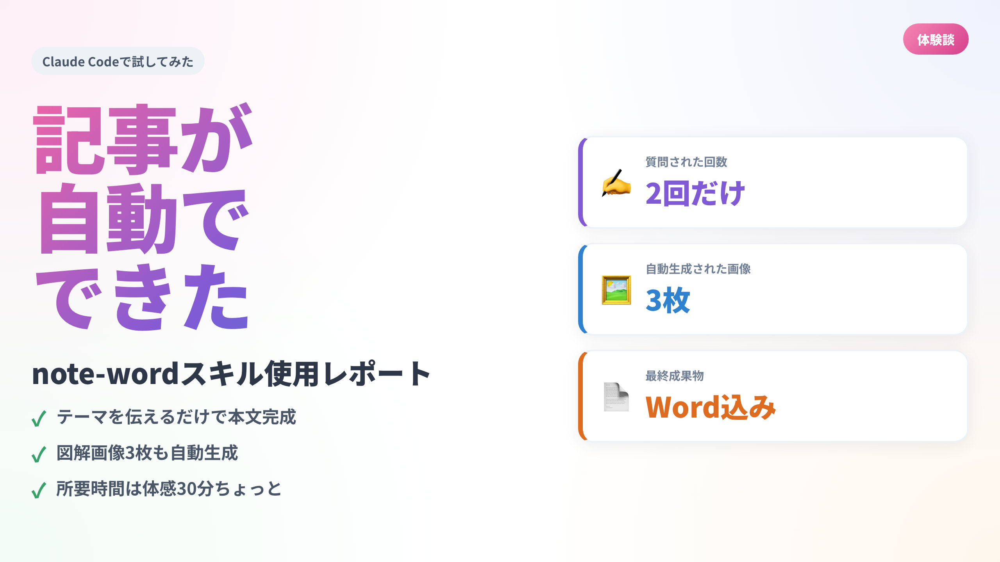
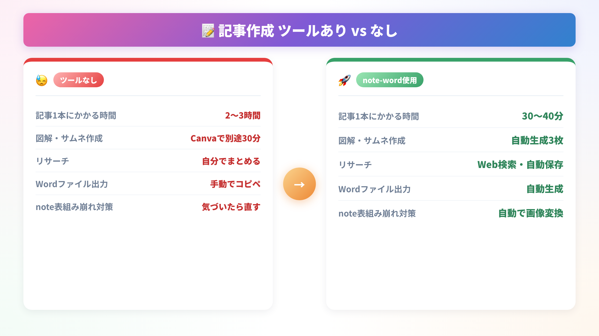

「テーマを入れたら記事が丸ごと出てくる」と聞いて、半信半疑だった。

自分でも試してみるまでは「どうせ雑な下書きが出るだけだろう」と思っていた。ところが実際に使ってみたら、記事本文・図解画像3枚・Wordファイルまで全部揃って出てきた。かかった時間は体感で30分ちょっと。

noteで発信している人なら一度は思ったことがあるはずだ。「記事を書きたいのに、書く時間が作れない」。平日は仕事で消耗して、休日は別の用事が入る。ネタはあっても、形にする時間がない。そのボトルネックを崩してくれそうなツールだった。

今回はその体験を、そのまま書き残しておく。



## 使ったのは「note-word スキル」というツール

### Claude Codeで動くローカルツール

今回使ったのは「簡易型Note作成くん」というClaude Code向けのスキルだ。フォルダをダウンロードして、Claude Codeで開くだけで使える。APIキーもブラウザログインも不要。

Claude Codeというのは、Anthropicが提供するAIコーディングアシスタントのCLIツールで、ターミナルやVS Codeから呼び出せる。コードだけでなく、こういった「定義済みの作業フロー（スキル）」を実行させることもできる。

スキルの実行はシンプルで、チャット欄に「note-wordスキルで〇〇について記事を書いて」と伝えるだけ。

### 使い始めるまでの準備

準備は2ステップ。

```bash
pip install -r requirements.txt
playwright install chromium
```

Playwrightというのは、Webブラウザを自動操作するライブラリだ。このスキルでは、HTMLで作った図解をブラウザでスクリーンショットして画像化するために使う。初回インストール時にChromium（約200MB）がダウンロードされる。それだけ。

## 実際に動かしてみた

### 質問は2つだけ

スキルを呼び出すと、まず2つだけ質問された。

1. **記事スタイルを選んでください**（有料記事向け / 無料記事・読み物 / その他）
2. **文字数はどのくらいにしますか？**（3,000字 / 10,000字 / 自由入力）

今回は「無料記事・読み物」「3,000字」を選んだ。この2つを答えたら、あとは何も聞いてこない。全部自動で進んでいく。

### 自動でやってくれたこと

Claude Codeが無音で次々と処理を進めていく様子は、見ていてなかなか面白かった。やっていたことをまとめると以下の通りだ。

- Web検索で記事テーマに関する事実・数値・事例を収集（出典URLつきで保存）
- 記事フォルダを自動作成（日付＋スラッグ形式）
- スタイルガイドを参照しながら本文を執筆
- 文字数が目標の±10%に収まるまで自動で追記・調整
- HTMLテンプレートを編集してPlaywrightで画像を3枚生成（サムネ＋図解×2）
- Markdownの表が含まれていれば自動で画像に変換（note非対応のため）
- 全部揃ったかゲートチェックをして、最後にWordファイルを生成


## できあがったもの

### 成果物の一覧

処理が完了すると、以下のファイルが1つのフォルダにまとまって出てきた。

- `article.md` — 本文Markdown（noteにそのままコピペできる）
- `article.docx` — Word版（画像込みで約2MB）
- `thumbnail.png` — サムネイル画像（1280×720px）
- `figure_01.png` — 図解1（ステップ図）
- `figure_02.png` — 図解2（Before/After比較）
- `research.md` — リサーチ結果（出典URL付き）
- `metadata.json` — タイトル・タグ・文字数などのメタ情報

### 画像の品質について

正直、ここが一番驚いた。

HTMLとCSSで作ったテンプレートをPlaywrightがスクリーンショットするので、見た目がきれいだ。グラデーションや枠線も出る。スマホで読まれることを前提にフォントが大きく設定されていて、縮小されても文字が読める。

自分でCanvaを開いて作るのと比べると、工数が段違いに少ない。内容だけ差し替えればいい状態のテンプレートが最初から入っているので、センスがなくてもそれなりの見た目になる。

テンプレートは3種類ある。サムネ用の「キャッチコピー型」、手順説明用の「ステップ図」、比較用の「Before/After」だ。記事テーマに合わせてスキルが自動で選んで、記事の内容を流し込んで画像化する。出力は全部1280×720pxのPNG。noteに貼るにはちょうどいいサイズだ。

一点だけ注意が必要なのは、初回だけPlaywrightのインストールに時間がかかること。Chromiumのダウンロードで数分かかる。2回目以降は一瞬で動く。



## 使ってみて感じたこと

### よかった点

**一番よかったのは「質問が2つだけ」という設計だ。**

AIツールを使っていると、途中で「どうしますか？」と何度も聞いてくる場面が多い。それがここでは徹底的に省かれている。判断が必要な部分は最初の2問で完結し、あとはスキルが勝手に選んで進める。

画像生成も「Playwrightが使えるなら使う、なければPILでフォールバック」と自動判定するので、こちらが何かを選ぶ必要がない。

もう一つよかったのが、**成果物がフォルダごとにきれいに整理される**点だ。記事タイトルから日付＋スラッグの形式でフォルダが自動生成され、本文・画像・Wordファイル・リサーチメモが全部そこに入る。「あの画像どこだっけ」という状況にならない。

さらに、Markdown記法の表（`| col | col |`）がnote.comで描画されない問題も、ツールが自動で検知して画像に変換してくれる。noteで記事が崩れるよくある失敗を、意識しなくても防げる。

### 気になった点

**本文の「声」は自分のものではない。**

出てきた文章はきれいに整っているが、自分が書いたような言い回しではない。そのまま公開するより、一度読んで手を入れたほうがいい。ツールが作ってくれるのは「下書きの完成版」であって、「自分の記事の完成版」ではないと思っている。

リサーチについても、Webから拾ってきた情報が骨格になるため、自分の体験や考えを追加しないと薄い記事になる。スキルはあくまで「土台を作る道具」だ。

**使うシーンをある程度選ぶ**とも感じた。「今日は書く気力ゼロだけど何か出さないといけない」という日の緊急戦力としては最高だ。一方で、自分の思考をゆっくり整理したいときや、体験談を丁寧に書きたいときは、最初から自分で書いたほうが速かったりする。全部これに頼るより、状況に応じて使い分けるのがいいと思う。

## まとめ

- テーマを伝えるだけで、本文・画像3枚・Wordファイルが揃う
- 質問は2つだけ。あとは**全部自動で処理**が進む
- 本文の「声」は自分のものではないので、**一度手を入れる前提**で使うのがいい
- 「ゼロから書く時間がない日の下書き生成器」として使うのが、今のところ一番しっくりきている

最初は半信半疑だったが、試して損はなかった。自分の体験を乗せれば、ちゃんと自分の記事になる。
